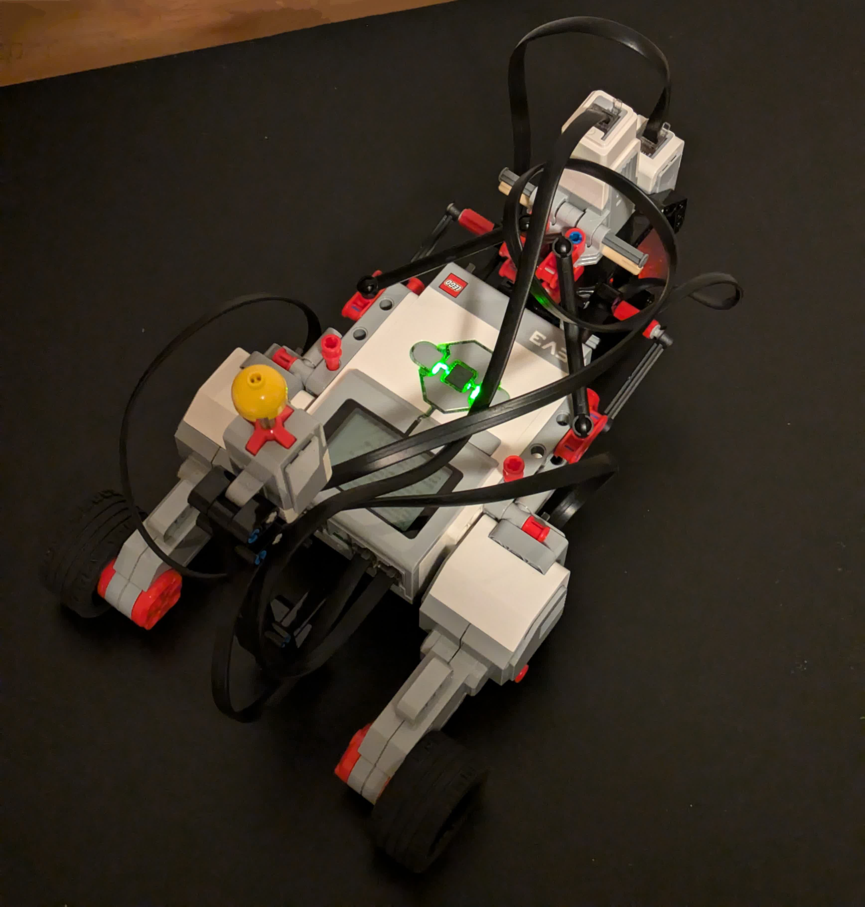
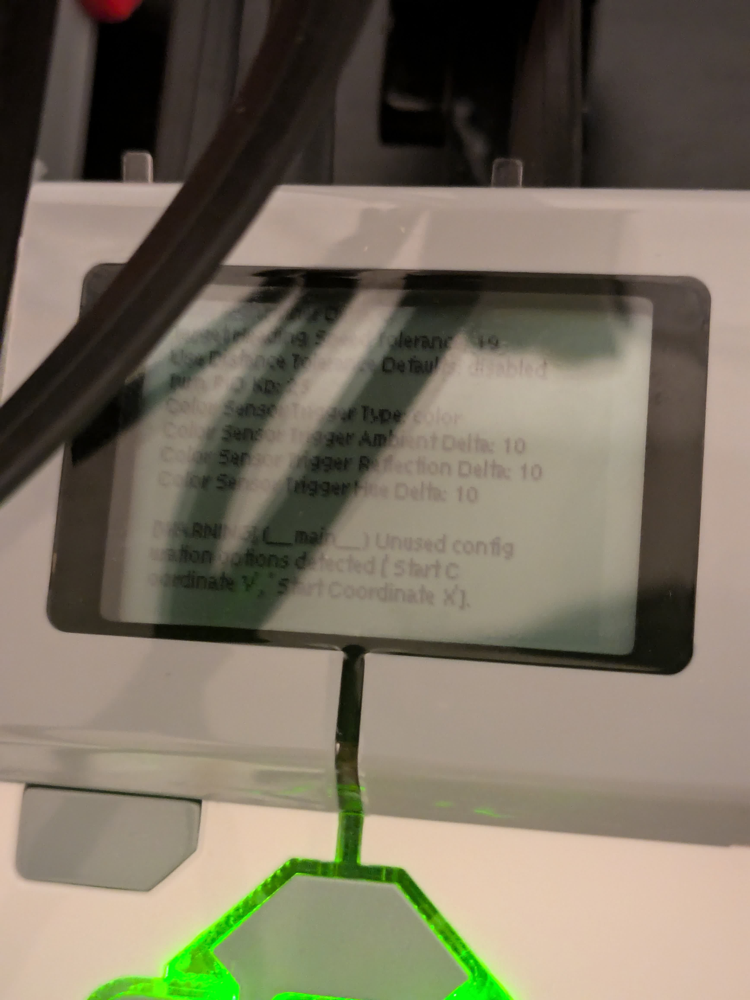

# roundabot
The most roundabout means of programming a robot.





## Why
You've signed up for a robotics competition and need to make a robot that:
- Fits within a 30x30 cm square in any orientation.
- Is powered only by AA or AAA batteries.
- Runs autonomously.

The objective is to navigate a 4x4 grid of 50x50 cm tiles through a series of obstacles to a certain position in an arbitrarily defined amount of time (75 seconds max).

Fortunately, you recall that you have a LEGO MINDSTORMS EV3 kit gathering dust somewhere, and decide that using this is far more economical than buying a bunch more parts.  
Unfortunately, you absolutely must make this more difficult than it needs to be. Thy robot shall:
- Not be a tank drive.
- Turn by pivoting around the left / right wheels. You don't have an omnidirectional caster wheel, so you'll have to programmatically steer the third wheel.
- Run Python, not blocks. You need file IO and manual PID control.
- Be programmed through a Raspberry Pi. Never mind why. You also happen to have a Raspberry Pi 2 B gathering dust somewhere.

You go to the competition and do well enough to place in the top three (hopefully).

---

The remainder of this file is a guide to getting started with the software side of this convoluted set up.

## Bill of Materials
- LEGO Technic parts (you build the robot; this guide is just software)
- EV3 control brick
- 4 GB min and 32 GB max microSD card
- Six or more AA batteries
- USB-A wifi adapter
- USB-A to **Mini-USB** cable (should come with EV3 kit)
- Raspberry Pi 2 B or higher
- 32 GB min and 256 GB max microSD card
- Raspberry Pi power source (outlet cable and/or portable battery pack)
- HDMI cable
- External monitor with power
- USB-A keyboard and mouse
- microSD flashing device
- Laptop with any modern web browser
> Tip: Rechargeable batteries are recommended. AA alkaline batteries will rapidly discharge with use.

## Set Up
```
Off Robot
┌─────────────────────────────────────────────────────────┐
│                               ┌───────────────────────┐ │
│                               │     Raspberry Pi      │ │
│ ┌────────┐ Hotspot Connection │ ┌───────────────────┐ │ │
│ │ Laptop │ ────────────────── │ │ OpenVsCode Server │ │ │
│ └────────┘                    │ └───────────────────┘ │ │
│                               └───────────────────────┘ │
└───────────────────────────────────────────│─────────────┘
                                            │ Mini-USB
On Robot                                    │
┌───────────────────────────────────────────│───────┐
│ ┌────────┐                         ┌────────────┐ │
│ │ Motors │ ─────────────────────── │    EV3     │ │
│ └────────┘                         │ ┌────────┐ │ │
│ ┌─────────┐                        │ │ ev3dev │ │ │
│ │ Sensors │ ────────────────────── │ └────────┘ │ │
│ └─────────┘                        └────────────┘ │
└───────────────────────────────────────────────────┘
```

## Instructions
> *If a command doesn't work, try prepending `sudo` before it.*
### Installations
1. Install the [Raspberry Pi Imager](https://www.raspberrypi.com/documentation/computers/getting-started.html#install-using-imager).
2. Follow the instructions to flash Raspberry Pi OS onto the **32 GB min** microSD card using your microSD flashing device.  
Insert the microSD card into your Raspberry Pi.
> Note: You may not have access to SSH later in this process, so be sure to configure your distribution with desktop support.
3. Download the latest [ev3dev image](https://www.ev3dev.org/docs/getting-started/) for LEGO MINDSTORMS EV3. This is the operating system you'll dual-boot into on the EV3.
4. Follow the instructions to flash ev3dev onto the **32 GB max** microSD card using your microSD flashing device.  
Insert the microSD card into your EV3.
> Tip: Just use the Raspberry Pi Imager (unzip the ev3dev image before flashing).
5. Connect your Pi to peripheral devices (keyboard, mouse, wifi adapter, monitor via HDMI cable).
6. Power on your Pi and follow the set up instructions.
7. On the Pi, download [OpenVsCode Server](https://github.com/gitpod-io/openvscode-server/releases) for **linux-armhf**. This server will enable you to access [VSCode / Code - OSS](https://github.com/microsoft/vscode) on the Pi from your laptop.
8. [Extract OpenVsCode Server](https://github.com/gitpod-io/openvscode-server#linux).
9. Configure OpenVsCode Server to start every time after the Raspberry Pi boots.  
Open a terminal and run `crontab -e`. Paste the following line at the bottom of the file:  
```
@reboot /full/path/to/bin/openvscode-server --host '0.0.0.0' --connection-token '<your token>'

# Replace "/full/path/to" with the actual path and <your token> with an authentication token of your choice.
```
### Networking
> Tip: Clone this repository onto the Pi now for reference later.
10. Turn the Pi into a hotspot.  
Open a terminal and run the following commands:
```bash
# Enable NetworkManager.
systemctl enable NetworkManager
systemctl status NetworkManager
systemctl start NetworkManager

# Create a new hotspot.
sudo nmcli device wifi hotspot ssid '<hotspot name>' password '<hotspot password>' ifname wlan0
# Replace <hotspot name> and <hotspot password> with values of your choice.

# Get the UUID of the newly created hotspot.
nmcli connection

# Configure the Pi to autoconnect to the hotspot.
sudo nmcli connection modify '<hotspot UUID>' connection.autoconnect yes connection.autoconnect-priority 100
# Replace <hotspot UUID> with the UUID obtained from the previous command.
# If you're using SSH over LAN, you'll need to reconnect once your Pi switches to being a hotspot, assuming you only have one wifi adapter.
# You can perform some of the steps above using the desktop interface. The default autoconnect values are "no" and "0", respectively.
```
11. Run `sudo shutdown -h now` or via the desktop to gracefully shutdown the Pi. Do not unplug it before then, as this could corrupt the microSD.
Once the Pi has shut down, unplug it, and then plug it back in to reboot. If your Pi has a power switch, use that.
12. Connect to the Pi hotspot using your laptop. Open a web browser and connect to OpenVsCode Server with [mDNS](https://www.raspberrypi.com/documentation/computers/remote-access.html#resolve-raspberrypi-local-with-mdns).  
Go to `raspberrypi.local:3000/?tkn=your_token`, where `your_token` is the OpenVsCode Server token you configured earlier.  
You should be able to access a VSCode-like interface directly in the browser and have shell access on the Pi.  
Open this repo if you cloned it earlier.
> Note: If you changed your Pi's hostname, use that instead of `raspberrypi`.
13. In the Code interface, install the [ev3dev-browser](https://open-vsx.org/vscode/item?itemName=ev3dev.ev3dev-browser) extension using the extension panel on the left.  
> Tip: Since Code is technically not VSCode, extensions are installed from [Open VSX](https://open-vsx.org/).
14. Insert six AA batteries into the EV3 and power it on by firmly pressing the button in the middle. Wait for the set up to complete.  
See "Boot ev3dev" [here](https://www.ev3dev.org/docs/getting-started/) for troubleshooting tips and other good information.
15. Connect your Pi to the EV3 using the Mini-USB cable. If your Pi has built-in bluetooth (Pi 2 B doesn't) or you have a spare wifi adapter, you can also look into [alternative network options](https://www.ev3dev.org/docs/networking/).  
16. You should be able to connect to the EV3 using the ev3dev-browser interface in the bottom-left of Code.  
See [Figure 12](https://pybricks.com/ev3-micropython/startrun.html#fig-connecting) for a similar arrangement.
17. Your Raspberry Pi will, on rare occasions, freeze when connected to the EV3. This is *probably* because it's attempting to download updates through the ethernet connection to the EV3, which isn't actually connected to the internet.  
**To stop this**, change the IPv6 Ethernet configuration to "Link-Local Only" on the **Pi desktop interface**:
    1. Open the network menu in top right.
    2. Go to Advanced Options > Edit Connections > the ethernet connection > the settings cog icon > IPv6 Settings.
    3. Set Method to "Link-Local Only".
### Running Programs
18. To run the currently selected file, open the debug side bar on the left and click on the little green triangle.
- If your robot is very similar to the one this repo was designed for, you may be able to reuse the source code and `.vscode` configuration files.
- The Pybricks MicroPython library for EV3 is already installed.
- MicroPython programs on the EV3 must begin with the shebang `#!/usr/bin/env pybricks-micropython`.
- Motors must be plugged into lettered ports and sensors into numbered ports.
- See [this page](https://pybricks.com/ev3-micropython/startrun.html) for a more visual guide.
### Shutdown
19. To shutdown the EV3, use the back button located on the EV3 or run `sudo poweroff` over an SSH connection to the EV3.
20. To shutdown the Pi, run `sudo shutdown -h now` or use the desktop interface.
> Please see Additional Resources below for troubleshooting and more in-depth information.

## System Information (April 2024)
### Raspberry Pi
```
PRETTY_NAME="Raspbian GNU/Linux 11 (bullseye)"
NAME="Raspbian GNU/Linux"
VERSION_ID="11"
VERSION="11 (bullseye)"
VERSION_CODENAME=bullseye
ID=raspbian
ID_LIKE=debian
HOME_URL="http://www.raspbian.org/"
SUPPORT_URL="http://www.raspbian.org/RaspbianForums"
BUG_REPORT_URL="http://www.raspbian.org/RaspbianBugs"
```
### ev3dev
```
ev3dev-stretch
```
### OpenVsCode Server
```
OpenVsCode Server
Version: 1.87.0
Commit: e3760f6c200e00bb2e549e76e533a349aeb014d3
Date: 2024-03-05T20:00:04.549Z
Browser: Mozilla/5.0 (X11; CrOS x86_64 14541.0.0) AppleWebKit/537.36 (KHTML, like Gecko) Chrome/122.0.0.0 Safari/537.36
```
### ev3dev-browser
```
Name: ev3dev-browser
Id: ev3dev.ev3dev-browser
Description: Browse for ev3dev devices
Version: 1.2.1
Publisher: ev3dev
VS Marketplace Link: https://open-vsx.org/vscode/item?itemName=ev3dev.ev3dev-browser
```

## Additional Resources
- [Raspberry Pi Documentation](https://www.raspberrypi.com/documentation/)
- [Raspberry Pi Hotspot](https://www.raspberrypi.com/tutorials/host-a-hotel-wifi-hotspot/)
- [USB Wikipedia](https://en.wikipedia.org/wiki/USB#Connector_type_quick_reference)
- [ev3dev Homepage](https://www.ev3dev.org/)
- [ev3dev-browser GitHub](https://github.com/ev3dev/vscode-ev3dev-browser)
- [Pybricks Documentation](https://pybricks.com/ev3-micropython/)
